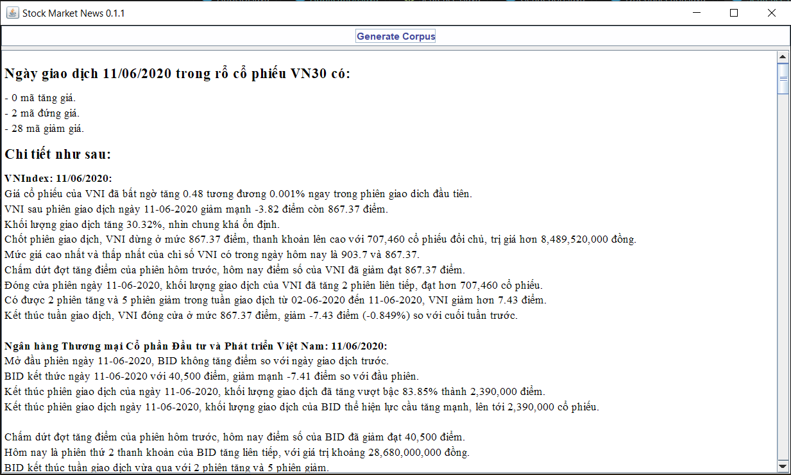

# Stock-Market-News
**a project in course OOP - IT3100** 

**TODO**
- Corpus for all market, not only stock.
- Improve Exception Handling
- Improve GUI - (Select stock exchange ...)
- Using data crawling (Now using SQL Server database and multiple CSV files) 
